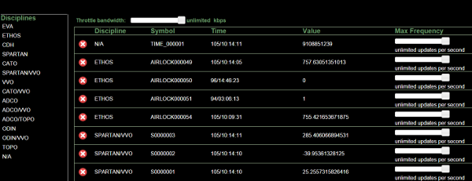

# Lightstreamer - ISSLive Demo - HTML Client

The Lightstreamer ISSLive Demo is a simple dashboard application fed with live telemetry data from the [International Space Station](https://www.nasa.gov/mission_pages/station/main/).

## Live Demo

[](https://demos.lightstreamer.com/ISSLive/)

### [ View live demo](https://demos.lightstreamer.com/ISSLive/)

## Details

This *ISSLive Demo* shows a simple dashboard containing a list of items, which can be subscribed with a click against the 
public Lightstreamer Server at push.lightstreamer.com. The incoming data is retrieved by such Lightstreamer Server from a public NASA feed and bridged 
to the clients subscribing to it: 
the pushed data is not simulated, is the actual telemetry data from the International Space Station.

The demo contains a list of categories: select a category to show the list of available symbols. Both categories and symbols are currently hard coded into the application. You can check out the full symbol dictionary [here](https://github.com/Lightstreamer/Lightstreamer-example-ISSLive-client-javascript/blob/master/src/assets/PUIList.xml). 

Each symbol is represented as an item in the Lightstreamer data model: single-item subscriptions are used to add/remove elements to the list of monitored symbols.
Through the Lightstreamer client library it is possible to limit the frequency of the updates per each single item and the bandwidth of the whole dashboard: 
sliders to control such aspects are available in this demo.

## Install

The adapter set used by this demo application is not available to be installed on a local Lightstreamer Server. As per now, and for the foreseeable future, the
server hosted at *push.lightstreamer.com* can be used to feed a local version of the client application.

* Download this project.
* Install the Angular CLI: open a terminal window and run the command `npm install -g @angular/cli` (Angular requires an [active LTS or maintenance LTS](https://nodejs.org/about/releases) version of Node.js).
* Change the current directory to the location of the file `package.json` and issue the commands `npm install` to install Angular libraries.
* Run the command `ng serve --open` (the command launches a web server, watches your files, and rebuilds the app as you make changes to those files.)

The client connects to the host `https://push.lightstreamer.com`. If you need to target a different Lightstreamer server, please search for this line:
```ts
lsClient = new LightstreamerClient
```
in `lsClient.ts` and change it accordingly.

The demo is now ready to be launched.

## See Also

There are other projects powered by the real-time ISS data streamed by our Lightstreamer Server. In particular, the [ISS Mimic project](https://github.com/ISS-Mimic/Mimic) has developed a moving 3D printed model of the International Space Station that uses the actual ISS live telemetry to mimic the actual positioning of the ISS solar arrays and radiators! They also visualize all of the ISS public telemetry in informative ways.
* [ISS Mimic Dashboard](https://iss-mimic.github.io/Mimic/dashboard.html)
* [Explanatory video showing the 3d-printed ISS model](https://www.youtube.com/watch?v=W9iZBjzOEEQ)

## Lightstreamer Compatibility Notes

* Compatible with Lightstreamer Web Client library version 9.0+ and Lightstreamer Server 7.4+.

* For a version of this example compatible with Lightstreamer SDK for Web Clients version 8.x or earlier, please refer to [this tag](https://github.com/Lightstreamer/Lightstreamer-example-ISSLive-client-javascript/releases/tag/for-client-8.x).

* For a version of this example compatible with Lightstreamer SDK for Web Clients version 7.x or earlier, please refer to [this tag](https://github.com/Lightstreamer/Lightstreamer-example-ISSLive-client-javascript/releases/tag/latest-for-client-7.x).
